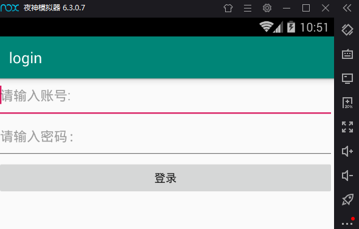

# reverse_android 从安卓开发到逆向
## [login 登录demo-通过androidkiller将apk转换为smali逆向](#jump1)
## [通过d2j-dex2jar将dex转换为java可读代码](#jump2)  

### 破解要求
即使用户名密码输入错误，也显示登录成功。
### <span id="jump1">破解方法</span>
1、找到MainActivity$login_button.smali  
2、修改代码，在.line 40下添加:cond_1  
3、修改判断语句后的执行结果，将cond_0改为cond_1  
4、重新编译apk  
  
### MainActivity.java
```java
package com.dazhuang.login;

import androidx.appcompat.app.AppCompatActivity;

import android.os.Bundle;
import android.view.View;
import android.widget.Button;
import android.widget.EditText;
import android.widget.Toast;

public class MainActivity extends AppCompatActivity {
    private EditText edit_loginname,edit_password;
    private Button login;

    @Override
    protected void onCreate(Bundle savedInstanceState) {
        super.onCreate(savedInstanceState);
        setContentView(R.layout.activity_main);

//        获取用户名密码
        edit_loginname = (EditText) findViewById(R.id.login_name);
        edit_password = (EditText) findViewById(R.id.login_password);
//        获取到按钮控件
        login = (Button) findViewById(R.id.submit);

//        给按钮设置点击事件,调用内部类
        login.setOnClickListener(new login_button());

    }

//    设置一个内部类
    private class login_button implements View.OnClickListener{
//        实现接口的方法
        public void onClick(View v){
//            获取文本框中的内容
            String username = edit_loginname.getText().toString().trim();
            String password = edit_password.getText().toString().trim();
//            判断用户名密码是否符合要求，通过吐司反馈
            if (username.equals("admin") && password.equals("admin888")){
                Toast.makeText(getApplicationContext(),"登录成功",Toast.LENGTH_SHORT).show();
            }else{
                Toast.makeText(getApplicationContext(),"登录失败",Toast.LENGTH_SHORT).show();
            };
        };
    }


}
```
### activity_main.xml
```xml
<?xml version="1.0" encoding="utf-8"?>
<!--<androidx.constraintlayout.widget.ConstraintLayout xmlns:android="http://schemas.android.com/apk/res/android"-->
<!--修改为线性布局管理器-->
<LinearLayout xmlns:android="http://schemas.android.com/apk/res/android"
    xmlns:app="http://schemas.android.com/apk/res-auto"
    xmlns:tools="http://schemas.android.com/tools"
    android:layout_width="match_parent"
    android:layout_height="match_parent"
    android:orientation="vertical"
    tools:context=".MainActivity">

    <!--添加两个文本框-->
    <EditText
        android:layout_width="match_parent"
        android:layout_height="wrap_content"
        android:paddingBottom="20dp"
        android:inputType="text"
        android:id="@+id/login_name"
        android:hint="@string/login_name"/>

    <EditText
        android:layout_width="match_parent"
        android:layout_height="wrap_content"
        android:paddingBottom="20dp"
        android:inputType="textPassword"
        android:id="@+id/login_password"
        android:hint="@string/login_password"/>
    <!--添加一个登录按钮-->
    <Button
        android:layout_width="match_parent"
        android:layout_height="wrap_content"
        android:text="@string/submit"
        android:id="@+id/submit"
        android:textSize="15sp" />

</LinearLayout>
```
### strings.xml
```xml
<resources>
    <string name="app_name">login</string>
    <string name="login_name">请输入账号:</string>
    <string name="login_password">请输入密码:</string>
    <string name="submit">登录</string>
</resources>
```
### 反编译后的smali代码MainActivity$login_button.smali
```java
.class Lcom/dazhuang/login/MainActivity$login_button;
.super Ljava/lang/Object;
.source "MainActivity.java"

# interfaces
.implements Landroid/view/View$OnClickListener;


# annotations
.annotation system Ldalvik/annotation/EnclosingClass;
    value = Lcom/dazhuang/login/MainActivity;
.end annotation

.annotation system Ldalvik/annotation/InnerClass;
    accessFlags = 0x2
    name = "login_button"
.end annotation


# instance fields
.field final synthetic this$0:Lcom/dazhuang/login/MainActivity;


# direct methods
.method private constructor <init>(Lcom/dazhuang/login/MainActivity;)V
    .locals 0

    .line 32
    iput-object p1, p0, Lcom/dazhuang/login/MainActivity$login_button;->this$0:Lcom/dazhuang/login/MainActivity;

    invoke-direct {p0}, Ljava/lang/Object;-><init>()V

    return-void
.end method

.method synthetic constructor <init>(Lcom/dazhuang/login/MainActivity;Lcom/dazhuang/login/MainActivity$1;)V
    .locals 0

    .line 32
    invoke-direct {p0, p1}, Lcom/dazhuang/login/MainActivity$login_button;-><init>(Lcom/dazhuang/login/MainActivity;)V

    return-void
.end method


# virtual methods
.method public onClick(Landroid/view/View;)V
    .locals 2

    .line 36
    iget-object p1, p0, Lcom/dazhuang/login/MainActivity$login_button;->this$0:Lcom/dazhuang/login/MainActivity;

    invoke-static {p1}, Lcom/dazhuang/login/MainActivity;->access$100(Lcom/dazhuang/login/MainActivity;)Landroid/widget/EditText;

    move-result-object p1

    invoke-virtual {p1}, Landroid/widget/EditText;->getText()Landroid/text/Editable;

    move-result-object p1

    invoke-virtual {p1}, Ljava/lang/Object;->toString()Ljava/lang/String;

    move-result-object p1

    invoke-virtual {p1}, Ljava/lang/String;->trim()Ljava/lang/String;

    move-result-object p1

    .line 37
    iget-object v0, p0, Lcom/dazhuang/login/MainActivity$login_button;->this$0:Lcom/dazhuang/login/MainActivity;

    invoke-static {v0}, Lcom/dazhuang/login/MainActivity;->access$200(Lcom/dazhuang/login/MainActivity;)Landroid/widget/EditText;

    move-result-object v0

    invoke-virtual {v0}, Landroid/widget/EditText;->getText()Landroid/text/Editable;

    move-result-object v0

    invoke-virtual {v0}, Ljava/lang/Object;->toString()Ljava/lang/String;

    move-result-object v0

    invoke-virtual {v0}, Ljava/lang/String;->trim()Ljava/lang/String;

    move-result-object v0

    const-string v1, "admin"

    .line 39
    invoke-virtual {p1, v1}, Ljava/lang/String;->equals(Ljava/lang/Object;)Z

    move-result p1

    const/4 v1, 0x0

    if-eqz p1, :cond_0

    const-string p1, "admin888"

    invoke-virtual {v0, p1}, Ljava/lang/String;->equals(Ljava/lang/Object;)Z

    move-result p1

    if-eqz p1, :cond_0

    .line 40
    iget-object p1, p0, Lcom/dazhuang/login/MainActivity$login_button;->this$0:Lcom/dazhuang/login/MainActivity;

    invoke-virtual {p1}, Lcom/dazhuang/login/MainActivity;->getApplicationContext()Landroid/content/Context;

    move-result-object p1

    const-string v0, "\u767b\u5f55\u6210\u529f"

    invoke-static {p1, v0, v1}, Landroid/widget/Toast;->makeText(Landroid/content/Context;Ljava/lang/CharSequence;I)Landroid/widget/Toast;

    move-result-object p1

    invoke-virtual {p1}, Landroid/widget/Toast;->show()V

    goto :goto_0

    .line 42
    :cond_0
    iget-object p1, p0, Lcom/dazhuang/login/MainActivity$login_button;->this$0:Lcom/dazhuang/login/MainActivity;

    invoke-virtual {p1}, Lcom/dazhuang/login/MainActivity;->getApplicationContext()Landroid/content/Context;

    move-result-object p1

    const-string v0, "\u767b\u5f55\u5931\u8d25"

    invoke-static {p1, v0, v1}, Landroid/widget/Toast;->makeText(Landroid/content/Context;Ljava/lang/CharSequence;I)Landroid/widget/Toast;

    move-result-object p1

    invoke-virtual {p1}, Landroid/widget/Toast;->show()V

    :goto_0
    return-void
.end method

```
### 更改完成的MainActivity$login_button.smali
```java
.class Lcom/dazhuang/login/MainActivity$login_button;
.super Ljava/lang/Object;
.source "MainActivity.java"

# interfaces
.implements Landroid/view/View$OnClickListener;


# annotations
.annotation system Ldalvik/annotation/EnclosingClass;
    value = Lcom/dazhuang/login/MainActivity;
.end annotation

.annotation system Ldalvik/annotation/InnerClass;
    accessFlags = 0x2
    name = "login_button"
.end annotation


# instance fields
.field final synthetic this$0:Lcom/dazhuang/login/MainActivity;


# direct methods
.method private constructor <init>(Lcom/dazhuang/login/MainActivity;)V
    .locals 0

    .line 32
    iput-object p1, p0, Lcom/dazhuang/login/MainActivity$login_button;->this$0:Lcom/dazhuang/login/MainActivity;

    invoke-direct {p0}, Ljava/lang/Object;-><init>()V

    return-void
.end method

.method synthetic constructor <init>(Lcom/dazhuang/login/MainActivity;Lcom/dazhuang/login/MainActivity$1;)V
    .locals 0

    .line 32
    invoke-direct {p0, p1}, Lcom/dazhuang/login/MainActivity$login_button;-><init>(Lcom/dazhuang/login/MainActivity;)V

    return-void
.end method


# virtual methods
.method public onClick(Landroid/view/View;)V
    .locals 2

    .line 36
    iget-object p1, p0, Lcom/dazhuang/login/MainActivity$login_button;->this$0:Lcom/dazhuang/login/MainActivity;

    invoke-static {p1}, Lcom/dazhuang/login/MainActivity;->access$100(Lcom/dazhuang/login/MainActivity;)Landroid/widget/EditText;

    move-result-object p1

    invoke-virtual {p1}, Landroid/widget/EditText;->getText()Landroid/text/Editable;

    move-result-object p1

    invoke-virtual {p1}, Ljava/lang/Object;->toString()Ljava/lang/String;

    move-result-object p1

    invoke-virtual {p1}, Ljava/lang/String;->trim()Ljava/lang/String;

    move-result-object p1

    .line 37
    iget-object v0, p0, Lcom/dazhuang/login/MainActivity$login_button;->this$0:Lcom/dazhuang/login/MainActivity;

    invoke-static {v0}, Lcom/dazhuang/login/MainActivity;->access$200(Lcom/dazhuang/login/MainActivity;)Landroid/widget/EditText;

    move-result-object v0

    invoke-virtual {v0}, Landroid/widget/EditText;->getText()Landroid/text/Editable;

    move-result-object v0

    invoke-virtual {v0}, Ljava/lang/Object;->toString()Ljava/lang/String;

    move-result-object v0

    invoke-virtual {v0}, Ljava/lang/String;->trim()Ljava/lang/String;

    move-result-object v0

    const-string v1, "admin"

    .line 39
    invoke-virtual {p1, v1}, Ljava/lang/String;->equals(Ljava/lang/Object;)Z

    move-result p1

    const/4 v1, 0x0

    if-eqz p1, :cond_1

    const-string p1, "admin888"

    invoke-virtual {v0, p1}, Ljava/lang/String;->equals(Ljava/lang/Object;)Z

    move-result p1

    if-eqz p1, :cond_1

    .line 40
    :cond_1
    iget-object p1, p0, Lcom/dazhuang/login/MainActivity$login_button;->this$0:Lcom/dazhuang/login/MainActivity;

    invoke-virtual {p1}, Lcom/dazhuang/login/MainActivity;->getApplicationContext()Landroid/content/Context;

    move-result-object p1

    const-string v0, "\u767b\u5f55\u6210\u529f"

    invoke-static {p1, v0, v1}, Landroid/widget/Toast;->makeText(Landroid/content/Context;Ljava/lang/CharSequence;I)Landroid/widget/Toast;

    move-result-object p1

    invoke-virtual {p1}, Landroid/widget/Toast;->show()V

    goto :goto_0

    .line 42
    :cond_0
    iget-object p1, p0, Lcom/dazhuang/login/MainActivity$login_button;->this$0:Lcom/dazhuang/login/MainActivity;

    invoke-virtual {p1}, Lcom/dazhuang/login/MainActivity;->getApplicationContext()Landroid/content/Context;

    move-result-object p1

    const-string v0, "\u767b\u5f55\u5931\u8d25"

    invoke-static {p1, v0, v1}, Landroid/widget/Toast;->makeText(Landroid/content/Context;Ljava/lang/CharSequence;I)Landroid/widget/Toast;

    move-result-object p1

    invoke-virtual {p1}, Landroid/widget/Toast;->show()V

    :goto_0
    return-void
.end method
```
***
### <span id="jump2">破解方法</span>
#### d2j-dex2jar软件下载地址
```text
链接：https://pan.baidu.com/s/1mHOl9y-LXnETUg3oDAKNvA 
提取码：3ygd 
```
1、首先解压缩apk  
2、将classes.dex复制到dex-tools-2.1-SNAPSHOT  
3、在命令行中输入d2j-dex2jar.bat classes.dex,经过反编译后会生成classes-dex2jar.jar  
4、使用jd-gui打开classes-dex2jar.jar即可查看  
5、或者直接使用androidkiller查看即可  
***
BUG：dazhuang_python@sina.com